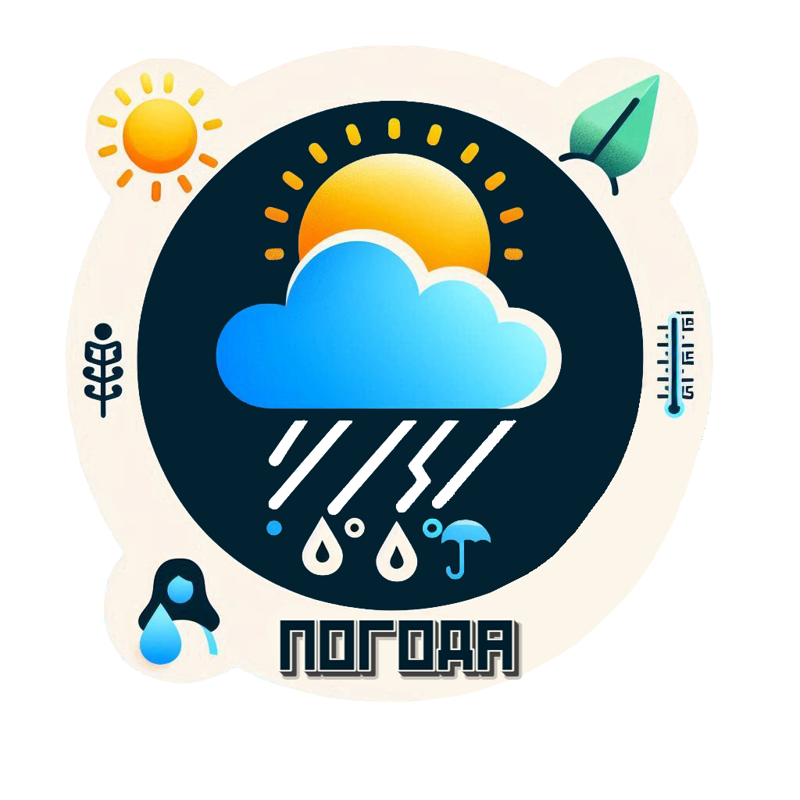
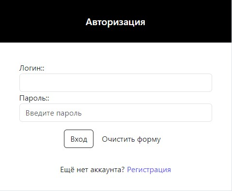
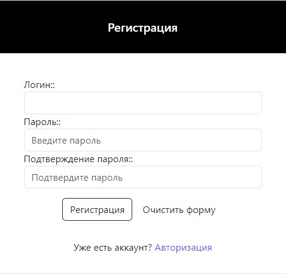
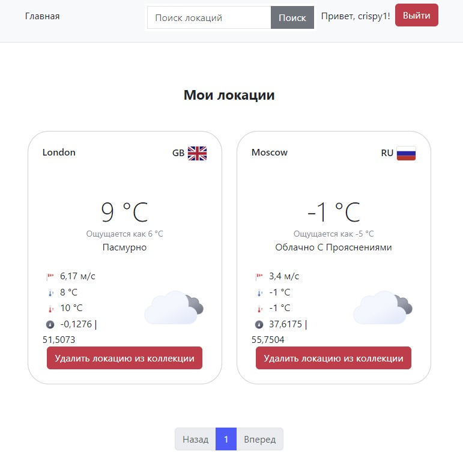
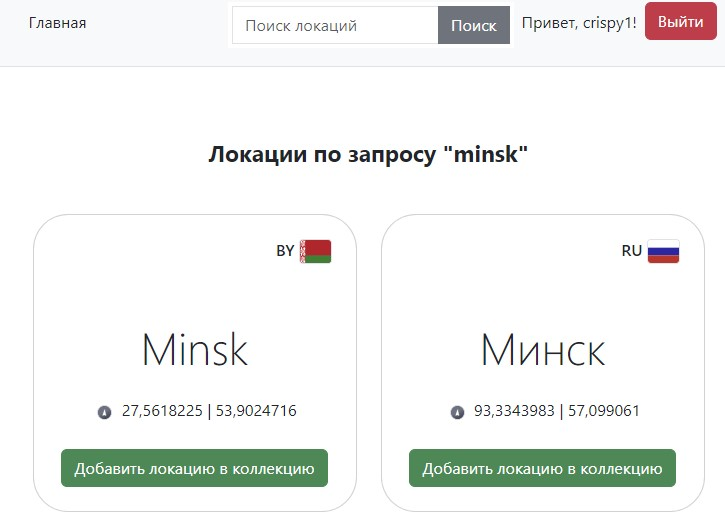
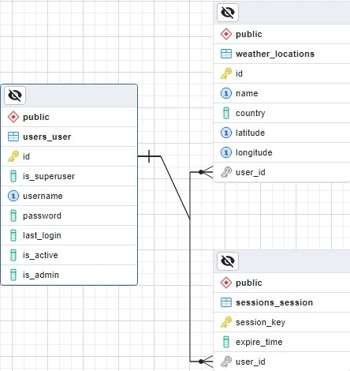

# Погода

Веб-приложение для просмотра текущей погоды. 
Пользователь может зарегистрироваться и добавить в коллекцию одну или несколько локаций (городов, сёл, других пунктов), 
после чего главная страница приложения начинает отображать список локаций с их текущей погодой.

Проект создан в рамках **Python Roadmap Сергея Жукова** -> [ссылка](https://zhukovsd.github.io/python-backend-learning-course/)
  

  

## Запуск проекта
1. Выполните клонирование проекта `git clone git@github.com:Wh4tisl0ve/Tennis_scoreboard.git`
2. Выполните установку Docker
3. Создайте .env файл и заполните переменные окружения  
**Для dev-версии проекта:**
4. Выполните сборку Docker-image `docker build -t weather_project_dev -f .\Dockerfile.dev .`
5. Выполните команду `docker-compose -f docker-compose.dev.yml up -d --build`  
**Для prod-версии проекта:**
4. Выполните сборку Docker-image `docker build -t weather_project_prod -f .\Dockerfile.prod .`
5. Выполните команду `docker-compose -f docker-compose.prod.yml up -d --build`

## Пример .env 
* SECRET_KEY=Cекретный ключ для Django
* DEBUG=Режим отладки(0 - выключен, 1 - включен)
* ALLOWED_HOSTS=Список доменов, которые может обслуживать это приложение
* DB_ENGINE=Используемый драйвер для работы с БД
* POSTGRES_DB=Имя БД
* POSTGRES_USER=Имя пользователя от БД
* POSTGRES_PASSWORD=Пароль от БД
* POSTGRES_HOST=Имя контейнера, в котором запущен PostgreSQL
* POSTGRES_PORT=Порт БД
* WEATHER_API_KEY=Уникальный ключ OpenWeatherAPI

## Структура приложений Django

* [weatherapp/auth](weatherapp/auth) - Приложение, отвечающее за аутентификацию пользователя
* [weatherapp/sessions](weatherapp/sessions) - Приложение, отвечающее за работу с сессиями
* [weatherapp/users](weatherapp/users) - Приложение, отвечающее за работу с пользователями
* [weatherapp/weather](weatherapp/weather) - Приложение, отвечающее за работу с основной логикой 

## Описание страниц проекта
### Страница авторизации
Адрес - `/accounts/login`.
Представляет собой форму для авторизации пользователей. 

### Страница регистрации
Адрес - `/accounts/register`. 
Представляет собой форму для регистрации пользователей. 

### Главная страница
Адрес - `/`. 
Представляет собой главную страницу приложения.

### Страница поиска локаций
Адрес - `/search`. 
GET параметр name содержит имя локаций.
Представляет собой главную страницу приложения. 
На данной странице отображается коллекция локаций пользователя.

## База данных(структура)
В качестве системы управления базами данных была выбрана PostgreSQL. 
Для управления объектами бд была использована Django ORM.
База данных содержит в себе 3 таблицы:
1. `Users` - таблица, содержащая информацию о пользователях.
2. `Sessions` - таблица, содержащая информацию о сессии пользователя.
3. `Locations` - таблица, содержащая информацию о коллекции локаций пользователя.

## Тесты
В качестве фреймворка для тестирования был использован unittest.
Юнит и интеграционными тестами был покрыт основной функционал приложения. 
Основные тест-кейсы:
* Проверка корректности аутентификации пользователя
* Проверка работы механизма сессий(создание/истечение срока).
* Проверка авторизации/регистрации пользователей.
* Проверка работы внешнего API. Сервис по работе с OpenWeatherAPI покрыт Мок-тестами.

## Стек 

* Python 3.12
* Django 5.1.2
* PostgreSQL
* docker
* unittest
* requests
* HTML/CSS(Bootstrap5)
